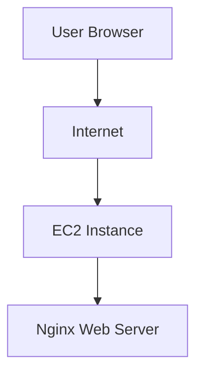

# Project 1 — EC2 Web Server

## Overview
This project demonstrates the deployment of a basic web server on AWS using EC2.

## Architecture
User → Internet → EC2 Instance → Nginx

## Resources Used
- Amazon EC2
- Security Group
- Key Pair
- Public IP
- Nginx

## What I Did
- Launched an EC2 instance
- Configured SSH access with a key pair
- Opened the required security group rules
- Installed and started Nginx
- Exposed a simple web page through the public IP

## Key Concepts
- EC2 as cloud compute
- Public IP access
- Security groups as firewall rules
- Basic Linux server administration

## Result
A working web server accessible from the internet through the EC2 public IP.

## Supporting Material
The full implementation process is documented through chronological screenshots available in the `/screenshots` folder for this project.

## Architecture Diagram

