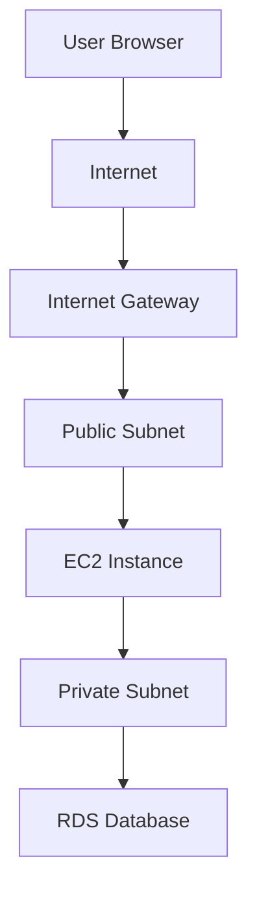

# Project 2 — Custom VPC with Public Subnet

## Overview
This project demonstrates the creation of a custom Virtual Private Cloud (VPC) in AWS, including subnet configuration, internet access, and deployment of an EC2 instance within the network.

## Architecture
User → Internet → Internet Gateway → Public Subnet → EC2 Instance → Nginx

## Resources Used
- Amazon VPC
- Subnet
- Internet Gateway
- Route Table
- EC2 Instance
- Security Group

## What I Did
- Created a custom VPC with CIDR block 10.0.0.0/16
- Created a public subnet (10.0.1.0/24)
- Created and attached an Internet Gateway
- Configured a route table with internet access (0.0.0.0/0)
- Associated subnet with route table
- Launched EC2 instance inside the subnet
- Enabled public IP assignment
- Installed and ran Nginx web server

## Key Concepts
- VPC as isolated cloud network
- Subnets for resource organization
- Internet Gateway for external access
- Route tables controlling traffic flow
- Public vs private networking

## Result
A working EC2 instance inside a custom VPC, accessible from the internet through a properly configured network.

## Supporting Material
The full implementation process is documented through chronological screenshots available in the `/screenshots` folder for this project.

## Architecture Diagram

