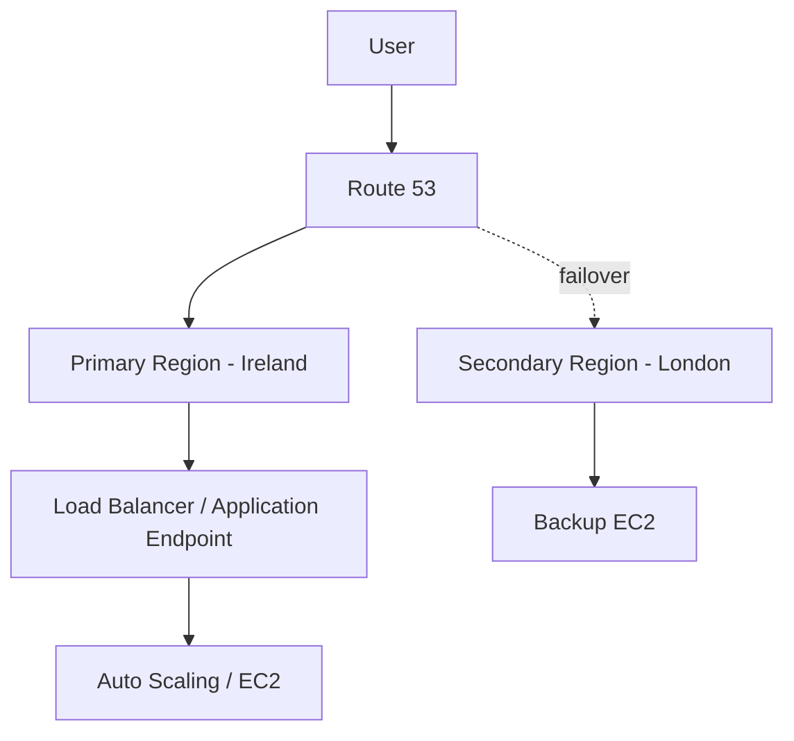

# Project 3 — High Availability with Route 53 Failover

## Overview
This project demonstrates a highly available architecture using AWS Route 53 failover routing. Two EC2 instances are deployed in different regions, with automatic traffic redirection in case of failure.

## Architecture
User → Route 53 → Primary EC2 (Ireland)  
                     ↓ (if unhealthy)  
             Secondary EC2 (London)

## Resources Used
- Amazon EC2 (2 instances in different regions)
- Route 53
- Health Checks
- DNS Failover Routing
- Security Groups

## What I Did
- Deployed two EC2 instances in different AWS regions (Primary and Secondary)
- Configured Nginx on both instances
- Created a Route 53 hosted zone for my domain (guido-cloud.com)
- Configured DNS records with failover routing policy
- Set primary and secondary endpoints
- Created a health check for the primary instance
- Linked the health check to Route 53 failover configuration
- Tested failover by stopping the primary instance

## Key Concepts
- High Availability (HA)
- DNS Failover
- Health Checks
- Multi-region architecture
- Fault tolerance

## Result
When the primary EC2 instance becomes unavailable, traffic is automatically redirected to the secondary instance, ensuring continuous availability of the application.

## Supporting Material
The full implementation process is documented through chronological screenshots available in the `/screenshots` folder for this project.

## Architecture Diagram



    A --> B
    B --> C
    B -. failover .-> D
```
