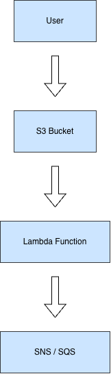

# Project 4 — Serverless Pipeline with S3 and Lambda

## Overview
This project demonstrates an event-driven serverless architecture in AWS. When a file is uploaded to an S3 bucket, a Lambda function is triggered automatically to process the event and generate a notification.

## Architecture
User → Amazon S3 → Lambda Function → SNS / SQS Notification

## Resources Used
- Amazon S3
- AWS Lambda
- Amazon SNS / SQS
- IAM Role / Permissions

## What I Did
- Created an S3 bucket to receive uploaded files
- Configured S3 event notifications
- Created a Lambda function triggered by object creation
- Assigned the required IAM permissions to the Lambda function
- Connected the workflow to SNS / SQS for notifications
- Tested the pipeline by uploading files and validating the event flow

## Key Concepts
- Serverless architecture
- Event-driven systems
- Object storage
- Function-as-a-Service (FaaS)
- Automated processing

## Result
A working serverless pipeline where file uploads to S3 automatically trigger Lambda execution and downstream notifications without requiring dedicated servers.

## Architecture Diagram

