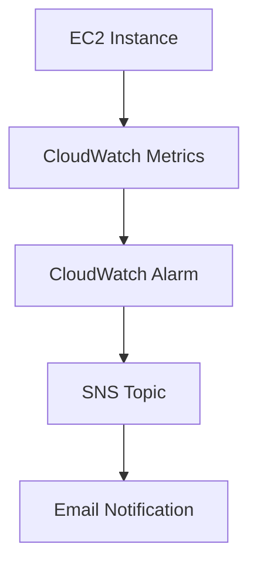

# Project 5 — Monitoring and Alerting with CloudWatch

## Overview
This project demonstrates how to monitor cloud resources using AWS CloudWatch and trigger automated alerts when defined thresholds are exceeded.

## Architecture
EC2 Instance → CloudWatch Metrics → Alarm → SNS Notification → Email

## Resources Used
- Amazon EC2
- Amazon CloudWatch
- Amazon SNS
- IAM Roles / Permissions

## What I Did
- Launched an EC2 instance
- Enabled detailed monitoring
- Selected CPUUtilization as the key metric
- Created a CloudWatch alarm based on CPU threshold
- Configured SNS topic for notifications
- Subscribed email to SNS topic
- Triggered the alarm by generating CPU load
- Verified alert delivery via email

## Key Concepts
- Monitoring and observability
- Metrics and thresholds
- Alerting systems
- Notification pipelines
- System reliability

## Result
A working monitoring system that detects abnormal CPU usage and sends automated email alerts, enabling proactive system management.

## Supporting Material
The full implementation process is documented through chronological screenshots available in the `/screenshots` folder for this project.

## Architecture Diagram

