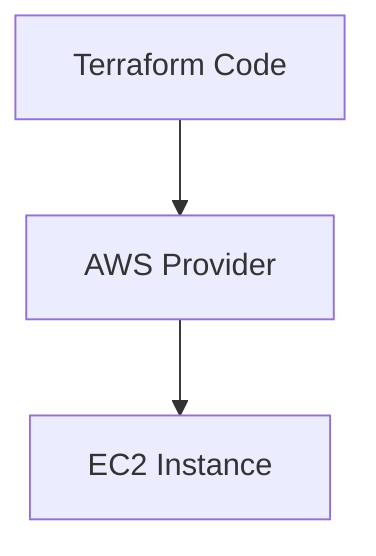

# Project 6 — Infrastructure as Code with Terraform

## Overview
This project demonstrates how to provision AWS infrastructure using Terraform. Instead of creating resources manually through the AWS Console, the infrastructure is defined in code and deployed in a repeatable way.

## Architecture
Terraform Code → AWS Provider → EC2 Instance

## Resources Used
- Terraform
- AWS Provider
- Amazon EC2
- AWS CLI
- IAM User / Access Keys

## What I Did
- Installed Terraform locally
- Configured AWS CLI credentials
- Created a Terraform project structure
- Defined AWS provider configuration
- Used a dynamic AMI lookup for Amazon Linux
- Deployed an EC2 instance through Terraform
- Resolved deployment errors related to AMI and subnet selection
- Verified the infrastructure was created successfully in AWS

## Key Concepts
- Infrastructure as Code (IaC)
- Automation
- Reproducible deployments
- Provider configuration
- Declarative infrastructure

## Result
A working Terraform configuration that automatically provisioned an EC2 instance in AWS, demonstrating an Infrastructure as Code workflow from configuration to deployment.

## Supporting Material
The full implementation process is documented through chronological screenshots available in the `/screenshots` folder for this project.

## Architecture Diagram

